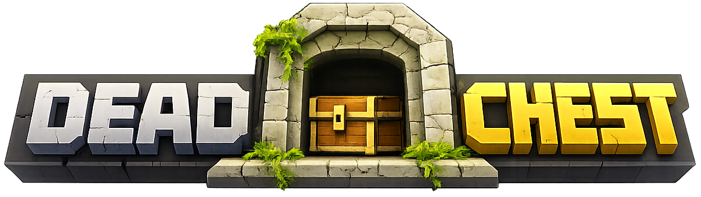

# DeadChest Documentation

  
Modern death-chest plugin for Bukkit, Spigot, and Paper. This documentation covers setup, configuration, integrations, and API usage.

[Get Started](installation.md){ .md-button .md-button--primary }
[Download](download.md){ .md-button }
[Configuration](configuration.md){ .md-button }

## Community

- [Discord support](https://discord.com/invite/jCsvJxS)
- [GitHub repository](https://github.com/apavarino/Deadchest)
- [Bukkit page](https://dev.bukkit.org/projects/dead-chest)
